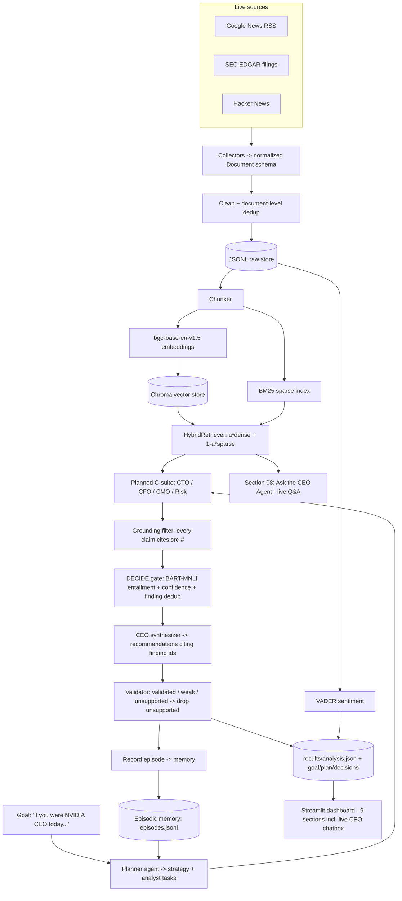
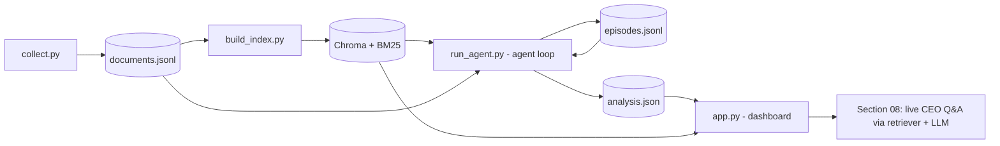

# NVIDIA AI-CEO — Strategic Intelligence Agent

An AI-powered **strategic intelligence agent** that continuously collects live public
information about **NVIDIA**, **plans** how to investigate a CEO-level goal, reasons over
retrieved evidence with a **local open-source LLM**, makes and logs **autonomous
decisions**, **validates** its recommendations against their evidence before presenting
them, and **remembers** previous runs — all surfaced in an interactive Executive
Intelligence Dashboard with a **live CEO chatbox** for ad-hoc strategic Q&A. It answers:
*"If you were the CEO today, what would you do next, and why?"*

No commercial LLM API is used for reasoning — the reasoning engine is **Qwen 3 8B** run
locally via Ollama.

> **This is an agent, not a prompt-and-answer pipeline.** It executes an explicit loop —
> **Goal -> Plan -> Retrieve -> Analyze -> Decide -> Recommend -> Validate** — threading a
> shared working-memory state, recording every decision to a visible trace, and
> conditioning each run on episodic memory of the runs before it.

## What it does

- **Plans before acting.** A planner agent reads the goal (and memory of past runs) and
  decides *which* specialist analysts to deploy, what to investigate, which queries to
  run, and why — instead of a hardcoded analyst list.
- **Collects** 350+ live documents from **three independent sources** (financial news, SEC
  filings, technical community) automatically.
- Cleans, deduplicates, chunks, embeds, and indexes them for **hybrid retrieval**.
- Runs a planned **multi-agent "C-suite"** (CTO, CFO, CMO, Risk Officer) that extracts
  opportunities, risks, and trends — each one **cited to its source evidence**.
- **Decides autonomously, with reasons logged.** A decision gate verifies every finding
  with a Natural Language Inference model, scores a transparent **confidence**, and drops
  near-duplicate findings — recording each choice to a decision trace.
- **Synthesises** a CEO view: prioritised **recommendations**, each citing the findings it
  rests on, plus an executive briefing.
- **Validates recommendations before presenting them.** Each recommendation is checked
  against its cited findings; unsupported ones are **dropped** and never shown.
- **Remembers.** Each run is recorded to episodic memory so the next run can reason about
  what changed ("are last run's top risks still active?").
- **Interactive CEO chatbox.** Ask the AI CEO agent any strategic question live — it
  retrieves evidence from the knowledge base and answers grounded in real sources.
- Presents everything in a **9-section, NVIDIA-themed Streamlit dashboard** — including
  Section 00 "Agent Reasoning" (goal, plan, decision trace), per-recommendation
  validation badges with evidence links, and Section 08 "Ask the CEO Agent" for live Q&A.

## Agent capabilities (how the design demonstrates agent behaviour)

| Capability | Where it lives |
|---|---|
| **Planning before execution** | `src/planner.py` — LLM decides analysts, queries, source filters, rationale |
| **Autonomous decision-making** | `src/orchestrator.py` decision gate + `AgentState.log` decision trace |
| **Tool use beyond the LLM** | hybrid retriever (Chroma + BM25) and BART-MNLI entailment verifier |
| **Retrieval & use of evidence** | `src/retrieval.py`; every finding cites retrieved chunks |
| **Analysis of risks / opportunities / trends** | planned C-suite analysts in `src/agents.py` |
| **Validation of recommendations** | `src/validator.py` — verdict validated / weak / unsupported (dropped) |
| **Memory** | semantic (Chroma+BM25), working (`AgentState`), episodic (`src/memory.py`) |
| **Multi-step, stateful control flow** | `src/orchestrator.py` loop + bounded re-plan |
| **Interactive agent Q&A** | Section 08 chatbox — live retrieval + LLM reasoning on user queries |

## System Architecture



The whole flow is threaded by one **`AgentState`** (working memory) and a **decision
trace**. If validation clears **zero** recommendations, the orchestrator **re-plans** once
(bounded by `MAX_AGENT_ITERATIONS`) — explicit conditional control flow.

## Data Flow (execution pipeline)



The heavy LLM reasoning runs **as a batch agent job** (`run_agent.py`) that writes
`analysis.json`; the dashboard reads that file for sections 00–07. **Section 08** calls
the LLM live via Ollama for interactive Q&A, grounded in the same knowledge base.

## AI Pipeline (the agent loop, step by step)

1. **Goal** — the run starts from an explicit CEO-level objective, set on the `AgentState`.
2. **Plan** — `planner.py` asks the LLM for a strategy + 3–6 analyst tasks (role, focus,
   queries, finding type, optional source filter, rationale), conditioned on the episodic
   **memory** briefing of the previous run. A deterministic fallback plan guarantees the
   run can't crash on a bad LLM response.
3. **Retrieve** — each planned task calls the `HybridRetriever`: `score = a*dense +
   (1-a)*sparse` (a = 0.6), with min-max normalization and an optional `source_type` filter.
4. **Analyze** — four specialist analysts turn retrieved chunks into `[src-#]`-cited
   findings (opportunities / risks / trends). Citations that don't match the retrieved
   evidence are dropped — the primary anti-hallucination mechanism.
5. **Decide** — the decision gate verifies each finding with `facebook/bart-large-mnli`
   (does the cited evidence *entail* the claim?), scores `confidence = 0.6*entailment +
   0.4*corroboration` (corroboration = distinct citing documents: 1 -> 0.34, 2 -> 0.68,
   3+ -> 1.0), then clusters and drops near-duplicate findings (cosine >= `DEDUP_THRESHOLD`,
   0.82, highest-confidence kept). Every decision is logged with its reason.
6. **Recommend** — the CEO agent turns the surviving findings into prioritised
   recommendations + an executive briefing. Each recommendation **cites the finding ids**
   (`F1`, `F3`...) it is based on, which are resolved back to the underlying evidence.
7. **Validate** — `validator.py` scores each recommendation by the confidence of its cited
   findings: **validated** (>= `VALIDATION_THRESHOLD`, 0.5), **weak** (kept but flagged), or
   **unsupported** (no resolvable evidence — **dropped before display**). A semantic
   fallback links recommendations that failed to cite. Evidence sources are attached for
   the dashboard (Task 6).
8. **Memory** — the run (goal, plan, top findings, recommendations) is appended to
   `data/memory/episodes.jsonl` so the next run's planner can reason about change.
9. **Sentiment & serve** — VADER over all documents (by source and over time); the
   dashboard renders the precomputed results plus the agent's goal, plan, and trace.
10. **Interactive Q&A** — Section 08 lets the user ask follow-up questions live. The
    chatbox retrieves relevant evidence from the same hybrid knowledge base, includes the
    current analysis context, and gets a grounded answer from Qwen — citing sources.

## Tech Stack

| Layer | Choice |
|---|---|
| Reasoning LLM | Qwen 3 8B (Ollama, local) |
| Planner / Validator / Orchestrator | custom Python agent layer (`planner.py`, `validator.py`, `orchestrator.py`) |
| Working / episodic memory | `state.py` (AgentState) / `memory.py` (episodes.jsonl) |
| Embeddings | BAAI bge-base-en-v1.5 |
| Vector store | ChromaDB (persistent) |
| Sparse retrieval | rank-bm25 (BM25Okapi) |
| Evidence verification | facebook/bart-large-mnli (NLI entailment) |
| Sentiment | VADER |
| Dashboard + chatbox | Streamlit + pandas + Plotly |
| Sources | Google News RSS, SEC EDGAR API, Hacker News (Algolia) |

## Design Decisions

- **Extend, don't rebuild.** The brief was clarified to require explicit *agent* behaviour
  on top of existing work. The proven RAG core (collectors, index, hybrid retriever,
  verifier, sentiment, dashboard) is reused unchanged; a thin agent layer — planner,
  state/memory, validator, orchestrator — was added around it.
- **Dynamic planning over a hardcoded analyst list.** The planner's roster is its action
  space; it chooses which analysts to run and how, conditioned on memory. This is the
  difference between "the developer decided what to investigate" and "the agent decided."
- **Open-source reasoning engine.** Qwen 3 8B leads its size class at multi-step
  instruction-following and structured JSON output, which the citation-bound design
  demands. Apache-2.0; runs in ~5 GB at 4-bit on a 16 GB M4. Ollama is the transport,
  swappable for Llama 3.1 / Mistral / Phi-4 without touching agent logic.
- **Hybrid retrieval.** BM25 nails exact terms (tickers, "H20", "Blackwell"); dense catches
  paraphrase ("GPU shortage" ~ "supply constraints"). Fusing both is the modern
  production-RAG pattern.
- **Evidence-grounded findings + NLI verification.** Every claim must cite retrieved chunks;
  uncited claims are discarded, and BART-MNLI checks whether the cited evidence *entails*
  the claim, so confidence reflects real semantic support — e.g. boilerplate findings
  correctly score low entailment while genuine, restated claims score high. (Low
  entailment means *inferred*, not false.)
- **Validation as a separate gate.** Findings are verified; recommendations are *validated*
  against those findings before display. Two independent checks — one on evidence, one on
  advice — and unsupported recommendations never reach the user.
- **Three kinds of memory.** Semantic (the Chroma + BM25 index the analysts retrieve from),
  working (the per-run `AgentState`), and episodic (a journal of past runs the planner
  reads). Episodic memory is what lets a run say "the prior top risk persists / has changed."
- **Interactive CEO chatbox.** Sections 00–07 show precomputed batch analysis; Section 08
  lets the user ask live follow-up questions grounded in the same knowledge base. This
  bridges the gap between "strategic report" and "strategic advisor."
- **Batch agent, instant dashboard.** Heavy LLM work is precomputed to a results store; the
  dashboard only reads it — necessary on a fanless laptop and clean architecture. Only the
  chatbox calls the LLM live.

## Dashboard sections

| Section | Content |
|---|---|
| **00 Agent Reasoning** | Goal, meta tags, plan cards, full decision trace |
| **01 Company Overview** | NVIDIA, industry, 357 docs, 3 sources |
| **02 Market Intelligence** | Most recent developments with links |
| **03 Opportunity Monitor** | Finding cards with entailment, confidence, evidence |
| **04 Risk Monitor** | Same format — risks sorted by confidence |
| **05 Sentiment Analysis** | VADER overall + by source type + over time |
| **06 Strategic Recommendations** | Validation badges (validated/weak) + evidence links |
| **07 CEO Briefing** | What happened / why it matters / what to do next |
| **08 Ask the CEO Agent** | Live chatbox — ask any strategic question, get grounded answers |

## Project structure

```
nvidia-ai-ceo/
  config.py                 # company, paths, models, retrieval/LLM/dedup/agent settings
  app.py                    # NVIDIA-themed dashboard (sections 00-08 incl. live chatbox)
  requirements.txt
  src/
    schema.py               # the normalized Document contract (content-hash doc_id)
    collectors/             # base + google_news + sec_edgar + hacker_news
    dedup.py  storage_raw.py
    indexing.py             # chunk -> embed -> Chroma
    retrieval.py            # HybridRetriever (BM25 + dense fusion)
    llm.py                  # local LLM (Ollama): chat_json for agents, chat_text for chatbox
    agents.py               # C-suite analysts + CEO synthesizer (cites finding ids) + grounding
    verifier.py             # BART-MNLI entailment + confidence blend
    sentiment.py            # VADER sentiment
    state.py                # AgentState: working memory + decision trace (PlanStep, Decision)
    memory.py               # EpisodicMemory: per-run episodes.jsonl + planner briefing
    planner.py              # Planner agent: goal + memory -> investigation plan
    validator.py            # Recommendation validator: validated / weak / unsupported
    orchestrator.py         # the explicit agent loop (Goal->Plan->...->Validate) + finding dedup
    analysis.py             # (legacy linear pipeline; superseded by orchestrator.py)
  scripts/
    collect.py              # fetch 350+ docs from 3 sources
    build_index.py          # chunk -> embed -> Chroma + BM25
    run_agent.py            # run the full agent loop
    run_analysis.py         # (legacy; superseded by run_agent.py)
    test_planner.py         # standalone planner test
    smoke_test.py           # quick sanity check
  data/
    raw/documents.jsonl     # collected corpus
    chroma/                 # vector store (persistent)
    results/analysis.json   # agent output (dashboard reads this)
    memory/episodes.jsonl   # episodic memory journal
```

## How to run

```bash
pip install -r requirements.txt
# Local LLM (once): install Ollama, then `ollama pull qwen3:8b`
python scripts/collect.py          # 350+ docs from 3 sources -> data/raw/documents.jsonl
python scripts/build_index.py      # chunk -> embed -> Chroma + BM25
python scripts/run_agent.py        # the agent loop -> data/results/analysis.json (+ memory)
streamlit run app.py               # open the dashboard (keep Ollama running for the chatbox)
```

Notes:
- Set a real contact email in `config.py` (`USER_AGENT`) — SEC EDGAR requires it.
- The first `run_agent.py` downloads `bart-large-mnli` (~1.6 GB) once.
- Run `run_agent.py` a **second time** to see the planner condition on episodic memory
  (the dashboard's Agent Reasoning panel shows "memory of previous run used").
- Sections 00–07 render from `data/results/analysis.json` without Ollama.
- **Section 08 (chatbox) requires Ollama running** — it calls the LLM live for each query.

## Key configuration knobs (`config.py`)

| Knob | Default | Effect |
|---|---|---|
| `HYBRID_ALPHA` | 0.6 | dense vs sparse weight in retrieval |
| `CHUNK_SIZE` / `CHUNK_OVERLAP` | 200 / 40 | passage size for indexing |
| `CONFIDENCE_THRESHOLD` | 0.7 | strong-vs-moderate confidence cutoff (finding display) |
| `USE_VERIFIER` | True | toggle BART-MNLI entailment check |
| `USE_FINDING_DEDUP` / `DEDUP_THRESHOLD` | True / 0.82 | finding-level dedup strength |
| `NEAR_DUPLICATE_THRESHOLD` | 0.92 | document-level near-duplicate cutoff |
| `VALIDATION_THRESHOLD` | 0.5 | min support confidence for a recommendation to be "validated" |
| `MAX_AGENT_ITERATIONS` | 2 | max planning passes; re-plans only if a pass validates zero recommendations |
